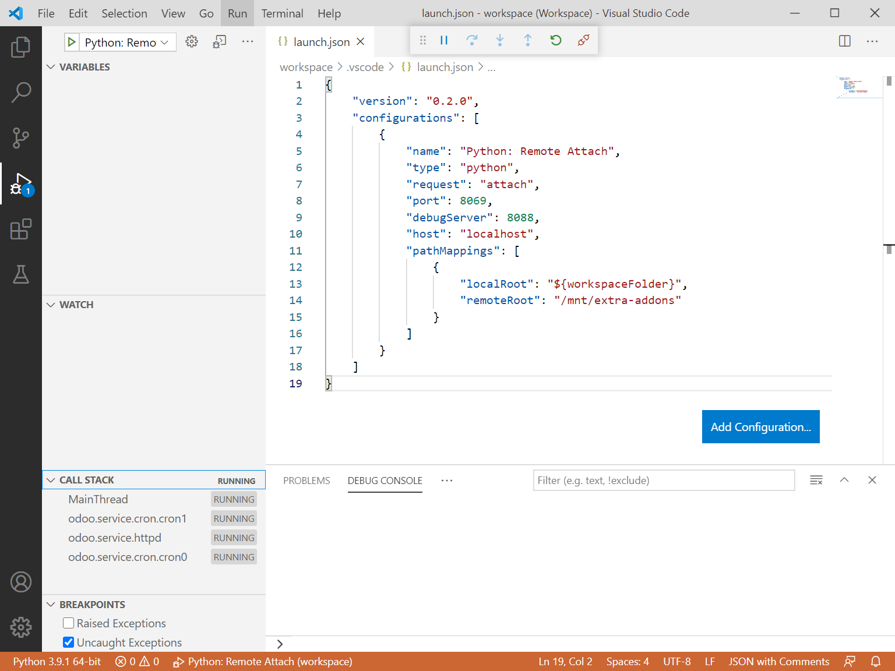

About this Repo
======

This is the Git repo of the official Docker image for [Odoo](https://registry.hub.docker.com/_/odoo/). See the Hub page for the full readme on how to use the Docker image and for information regarding contributing and issues.

The full readme is generated over in [docker-library/docs](https://github.com/docker-library/docs), specifically in [docker-library/docs/odoo](https://github.com/docker-library/docs/tree/master/odoo).

Remote Debug
======

With minor modification to Dockerfile and entrypoint.sh, you can use debugpy to
attach your local code to docker remotely.

Suppose this repo is cloned to `D:\workspace\docker`. You can compile and start
docker with this command:

```shell
docker build -t kimim/odoo .
docker run -d -e POSTGRES_USER=odoo -e POSTGRES_PASSWORD=odoo \
    -e POSTGRES_DB=postgres --name db postgres:10
docker run -v /mnt/d/workspace/odoo:/mnt/extra-addons -p 8088:8088 -p 8069:8069 \
    --name odoo --link db:db -t kimim/odoo
```

Then open vscode workspace in `D:\workspace\docker\workspace` and execute
`Run->Start Debugging` or shortcut `F5`.

When the status bar turns to orange, you are connected to the instance in docker.


